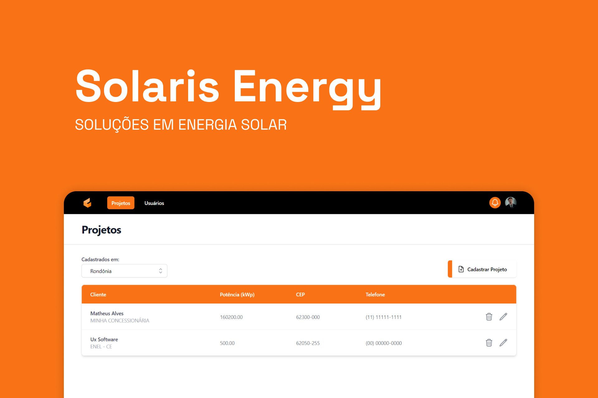

<h1 align="center">
  
</h1>

<h3 align="center">
  Solaris Energy :sunflower:
</h3>

<p align="center">Portal para gerenciar projetos e usuários vinculados a empresa Solaris Energy.</p>

<p align="center">

<a href="https://www.linkedin.com/in/matheralvs/" target="_blank" rel="noopener noreferrer">

</a>
<a href="https://github.com/matheralvs/solaris-energy/commits/main">

</a>
<a href="https://github.com/matheralvs/solaris-energy/issues">

</a>
</p>

<p align="center">
<a href="#-sobre-o-projeto">Sobre o projeto</a> •
<a href="#-tecnologias">Tecnologias</a> •
<a href="#-como-começar">Como começar</a> •
</p>

## ✅ Sobre o projeto

Este projeto é parte de um desafio da empresa UX Software para vaga de estágio como desenvolvedor. A proposta consistia em criar uma aplicação estilo dashboard, para ministrar projetos e usuários de uma determinada empresa solar.

## 🚀 Tecnologias

Tecnologias que usei para desenvolver a aplicação:

- [ReactJS](https://pt-br.reactjs.org/)

- [Vite JS](https://vitejs.dev/)

- [TypeScript](https://www.typescriptlang.org/)

- [TailwindCSS](https://tailwindcss.com/)

- [Firebase](https://firebase.google.com/docs?hl=pt)

- [ViaCEP](https://viacep.com.br/)

- [IBGE](https://servicodados.ibge.gov.br/api/docs)

## 💻 Como começar

**Clone o projeto e acesse a pasta:**

```bash

$ git clone https://github.com/matheralvs/solaris-energy.git && cd solaris-energy

```

**Siga os seguintes passos:**

```bash
# Install the dependencies

$ npm i

# To finish, run

$ npm run dev

# Well done, project is started!
```

Made with :purple_heart: by Matheus Alves 🤝 [See my linkedin](https://www.linkedin.com/in/matheralvs/)
